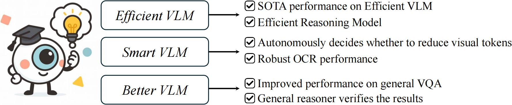
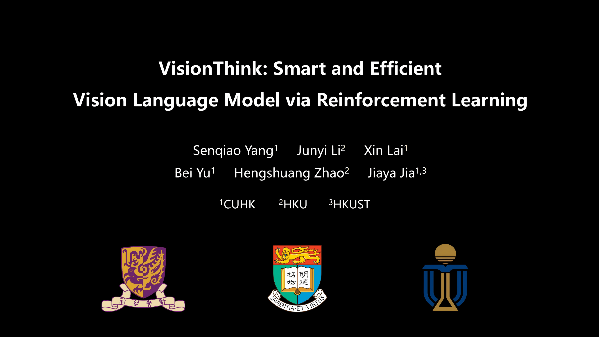

<p align="center" width="100%">

</p>

# VisionThink: Smart and Efficient Vision Language Model via Reinforcement Learning


[](files/VisionThink-Arxiv.pdf)
[](https://huggingface.co/papers/2412.04467)
[](https://github.com/dvlab-research/VisionThink/blob/main/LICENSE)
<a href='https://huggingface.co/collections/Senqiao/visionthink-6878d839fae02a079c9c7bfe'></a>

## TABLE OF CONTENTS
1. [News](#news)
2. [Highlights](#highlights)
3. [Video](#video)
4. [Installation](#installation)
5. [Train](#train)
6. [Evaluation](#evaluation)
7. [Citation](#citation)
8. [Acknowledgement](#acknowledgement)
9. [License](#license)
      
## News

- [x] [2025.07.18] We release [Paper](files/VisionThink-Arxiv.pdf) and this GitHub repo.
- [x] [2025.07.17] All data and model can be found at [here](https://huggingface.co/collections/Senqiao/visionthink-6878d839fae02a079c9c7bfe).

**VisionThink: Smart and Efficient Vision Language Model via Reinforcement Learning [[Paper](files/VisionThink-Arxiv.pdf)]** <br />
[Senqiao Yang](https://scholar.google.com/citations?user=NcJc-RwAAAAJ),
[Junyi Li](https://scholar.google.com/citations?hl=zh-CN&user=zQ0P3JAAAAAJ),
[Xin Lai](https://scholar.google.com/citations?user=tqNDPA4AAAAJ),
[Bei Yu](https://scholar.google.com/citations?user=tGneTm4AAAAJ),
[Hengshuang Zhao](https://scholar.google.com/citations?user=4uE10I0AAAAJ),
[Jiaya Jia](https://scholar.google.com/citations?user=XPAkzTEAAAAJ)<br />

## Highlights
<p align="center" width="80%">

</p>

1. Our VisionThink leverages reinforcement learning to **autonomously** learn whether to reduce visual tokens. Compared to traditional efficient VLM approaches, our method achieves significant improvements on **fine-grained** benchmarks, such as those involving OCR-related tasks.

2. VisionThink improves performance on **General VQA** tasks while reducing visual tokens by **50%**, achieving **102%** of the original model’s performance across nine benchmarks.

3. VisionThink achieves strong performance and efficiency by simply resizing input images to reduce visual tokens. We hope this inspires further research into **Efficient Reasoning  Vision Language Models**.

## Video
<p align="center" width="80%">
  <a href="https://youtu.be/RCRwV10Loc4" target="_blank">
    
  </a>
</p>


## Installation

The environment is follow the [Verl](https://github.com/volcengine/verl).
```
git clone https://github.com/dvlab-research/VisionThink.git
conda create -n visionthink python=3.11 -y
conda activate visionthink
# veRL
pip3 install -e . 
# flash-attn
pip3 install flash-attn --no-build-isolation
```
If you want to use the Qwen3 as Judge Model.
```
pip install -U tensordict
pip install transformers==4.51.0
```


## Train
### Data Preparation

#### Dataset for General VQA
```
huggingface-cli download --repo-type dataset --resume-download Senqiao/VisionThink-General-Train --local-dir datasets/VisionThink-General-Train
huggingface-cli download --repo-type dataset --resume-download Senqiao/VisionThink-General-Val --local-dir datasets/VisionThink-General-Val
```

#### Dataset for Efficient Reasoning VLM

```
huggingface-cli download --repo-type dataset --resume-download Senqiao/VisionThink-Smart-Train --local-dir datasets/VisionThink-Smart-Train
huggingface-cli download --repo-type dataset --resume-download Senqiao/VisionThink-Smart-Val --local-dir datasets/VisionThink-Smart-Val
```

### General VQA Improvement via Reinforcement Learning

To use GPT as the reward model, first set the following environment variables:

```
AZURE_API_KEY=
AZURE_ENDPOINT=
AZURE_API_VERSION=
```

Then run:

```
bash scripts/run_generalqa_4o_judge.sh
```

For ease of use, we also support using Qwen3 as the reward model. The relevant logic is implemented in `RewardModelWorker`, and no additional setup is needed:

```
bash scripts/run_generalqa_qwen3_judge.sh
```

After training completes, convert the model to Hugging Face format using:

```
python scripts/model_merger.py --local_dir <your_model_path>
```
Our trained model, VisionThink-General, based on Qwen2.5-VL-7B, is available [here](https://huggingface.co/Senqiao/VisionThink-General).

---

### Efficient Reasoning Vision-Language Models

Run the following script:

```
bash scripts/run_efficient_gpt4o_judge.sh
```

Our trained model, VisionThink-Efficient, based on Qwen2.5-VL-7B, is available [here](https://huggingface.co/Senqiao/VisionThink-Efficient).


## Evaluation
The evaluation code follows the structure of [Lmms-Eval](https://github.com/EvolvingLMMs-Lab/lmms-eval).
Please place `scripts/vllm_tool.py` into the `lmms_eval/models/` directory.
The evaluation scripts are similar to those used for other models. For example:

```
CUDA_VISIBLE_DEVICES="0,1,2,3" python3 -m lmms_eval \
    --model vllm_tool \
    --model_args model_version=${MODEL_DIR},tensor_parallel_size=4,trust_remote_code=True,max_images=2,prompt=tool_call,enable_tool_call=True,downsample_image=True \
    --tasks ${TASKS} \
    --batch_size 1024 \
    --log_samples \
    --log_samples_suffix vllm \
    --output_path ./lmms_eval_logs/${MODEL_NAME} \
    --verbosity DEBUG
```
## Citation
If you find this project useful in your research, please consider citing:

```

```


## Acknowledgement
- This work is built upon [Verl](https://github.com/volcengine/verl), [EasyR1](https://github.com/hiyouga/EasyR1), [Lmms-Eval](https://github.com/EvolvingLMMs-Lab/lmms-eval), and [MMSearch-R1](https://github.com/EvolvingLMMs-Lab/multimodal-search-r1). We thank them for their excellent open-source contributions.

- We also thank [Qwen](https://github.com/QwenLM/Qwen2.5-VL), [DeepSeek-R1](https://github.com/deepseek-ai/DeepSeek-R1), [VisionZip](https://github.com/dvlab-research/VisionZip), [FastV](https://github.com/pkunlp-icler/FastV), [SparseVLM](https://github.com/Gumpest/SparseVLMs), and others for their contributions, which have provided valuable insights.

## License
- VisionThink is licensed under the Apache License 2.0. 
